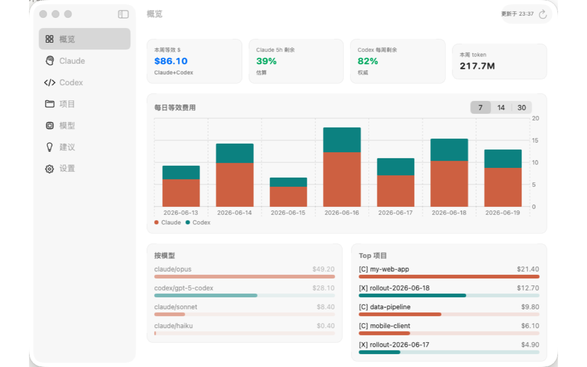
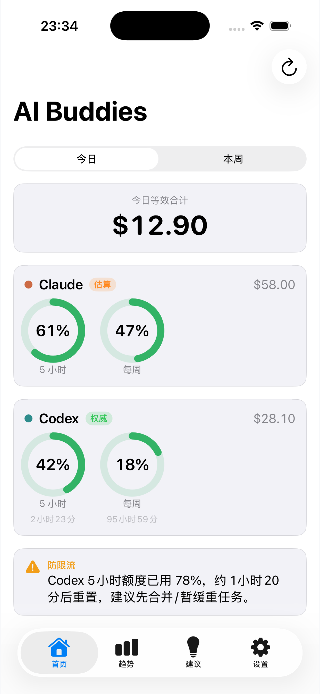
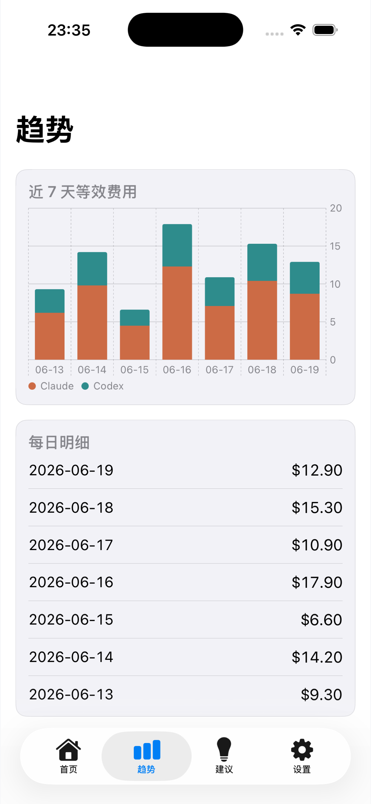
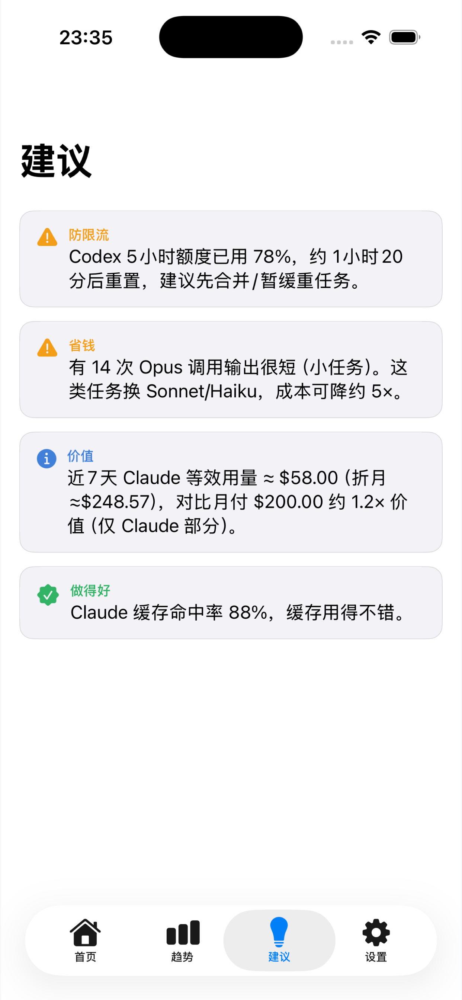
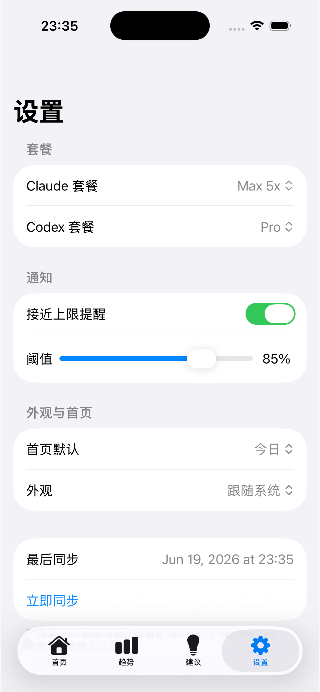

# AI Buddies

AI Buddies is an open-source macOS and iOS app for understanding Claude Code
and Codex usage from local CLI logs. It turns local usage files into dashboards,
cost estimates, rate-window hints, project breakdowns, model breakdowns, and
practical tips for working more efficiently with coding agents.

## Screenshots

### macOS Dashboard



### iOS Companion

<p>
  
  
  
  
</p>

## What It Does

- Parses local Claude Code and Codex usage files on macOS.
- Aggregates token counts, estimated pay-as-you-go cost, model usage, and
  project-level trends.
- Publishes aggregate snapshots through the user's private CloudKit database so
  the iOS app and widgets can display usage away from the Mac.
- Avoids syncing code, prompts, or conversation content.

## Apps

- `AIBuddiesMac`: menu bar app and full dashboard.
- `AIBuddiesiOS`: companion iOS dashboard.
- `AIBuddiesWidgets`: iOS widgets.
- `Packages/UsageCore`: shared parser, aggregation, pricing, and tips engine.

## Build

Prerequisites:

- Xcode
- XcodeGen
- Swift Package Manager

Generate the Xcode project:

```bash
cd AIBuddies
xcodegen generate
```

Run tests:

```bash
swift test --package-path Packages/UsageCore
```

Run the unsigned release gate:

```bash
Scripts/release_gate.sh --unsigned-only
```

## Apple Account Setup

The repo uses placeholder bundle IDs and entitlements. Before signing or
submitting to the App Store, replace `com.example.aibuddies` values in:

- `AIBuddies/Config.xcconfig`
- `AIBuddies/Shared/Constants.swift`
- `AIBuddies/Apps/*/*.entitlements`
- fastlane environment variables

See `AIBuddies/Docs/SUBMISSION.md`.

## Security

Do not commit:

- `.p8` App Store Connect keys
- Apple account emails
- Team IDs
- App Store Connect issuer IDs or key IDs
- API tokens
- Generated usage snapshots
- Xcode build output

The project is designed to work from local files and private CloudKit data.
Treat any real usage snapshot as private.

## Try The Tools

AI Buddies is built for developers who actively use Claude Code and Codex.
Referral offers vary by account, plan, region, and active promotion. Replace
these placeholders with your own eligible referral links before sharing:

- Claude Code: `ADD_YOUR_CLAUDE_REFERRAL_LINK`
- Codex: `ADD_YOUR_CODEX_REFERRAL_LINK`

## License

MIT. See `LICENSE`.
